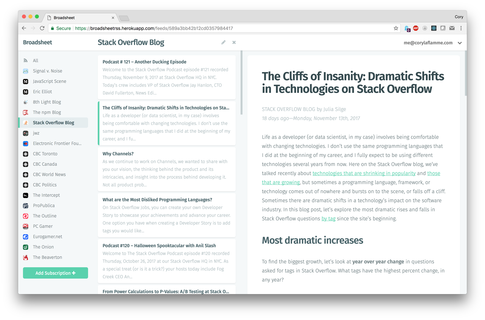

# Broadsheet

I'm sick of software oozing into every crack and crevice of my life. I'm sick of recommendations. Sick of social media sites. Sick of trackers, beacons, and ads. Sick of corporations selling my interests and reading habits to scum-sucking marketers.

Broadsheet does less for you, and knows less about you, than anything else out there. If you're sick of computers pretending to be your friend, you might like broadsheet.

### Less is Less

Broadsheet intentionally has few features. I mean, how much bullshit do you need to read the news?

- **No recommendations.** Add whatever websites you like without being harassed by a shity recommendation "engine".
- **No social media integration.** No one cares that you read an article. It's just another way for twitter and facebook to target you with interest-based ads.
- **No Pocket/Instapaper integration.** News is ephemeral. If it's really important, you'll remember.
- **No tracking or analytics.** If a company needs a graph to tell them that their software sucks, then the software is not the problem.
